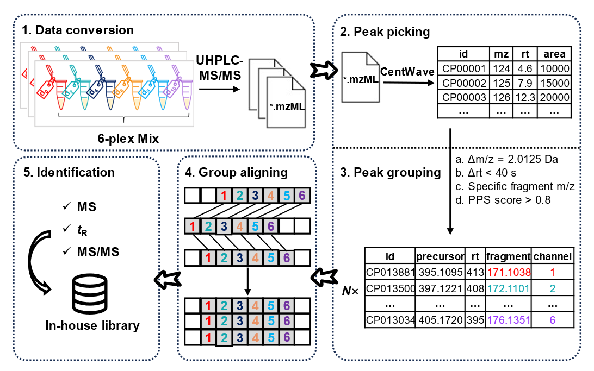
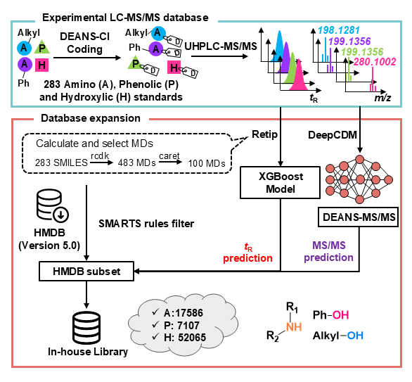

MetaboMultiplex
================

This R package is specifically designed to automate the processing of
multiplexed untargeted meatbolomics data, which implements several
critical functions including peak picking, peak grouping, group aligning
and metabolite identification.  We build
a in-house library for identification of derivatized metabolites.


## How to start

We use

### Prepare data

``` r
summary(cars)
```

    ##      speed           dist       
    ##  Min.   : 4.0   Min.   :  2.00  
    ##  1st Qu.:12.0   1st Qu.: 26.00  
    ##  Median :15.0   Median : 36.00  
    ##  Mean   :15.4   Mean   : 42.98  
    ##  3rd Qu.:19.0   3rd Qu.: 56.00  
    ##  Max.   :25.0   Max.   :120.00

Note that the `echo = FALSE` parameter was added to the code chunk to
prevent printing of the R code that generated the plot.
