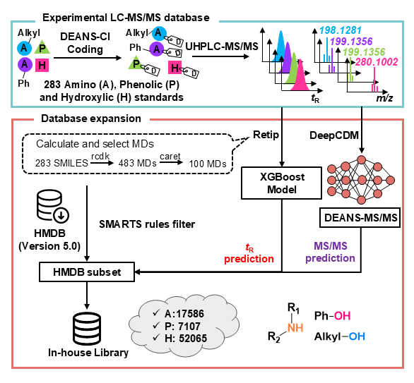

```{r setup, include=FALSE}
knitr::opts_chunk$set(echo = TRUE)
```

We build a in-house library for identification of derivatized metabolites.



You can load this library:

``` r
ms2Library <- load_DEANSBANK(thread = 3)
cmpLibrary_Amine <- load_AmidoLibrary()
cmpLibrary_Phenol <- load_PheHydroLibrary()
cmpLibrary_Alcohol <- load_HydroxylLibrary()
```
